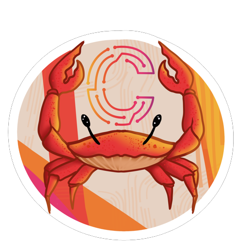

# The association WebSite and its discord bot 

<div style="text-align: center;">
  
</div>

___
## Installing and Running the Website
 
 1. Install node.js by follow the steps at https://nodejs.org/fr
  or with chocolatey using `choco install nodejs` 

        git clone https://github.com/Crobot-ic/WebSite.git
 
    or download the [zip](https://github.com/Crobot-ic/WebSite/archive/refs/heads/main.zip) 
 file
 
 2. Navigate to the Website directory and install the Node Package

        cd ./Web

        npm instamm 
        
3. To view the website in your web browser, run: 
        
        npm run dev -- --open

> :bulb: If you want to access the website on your smartphone with the same IP, use: 
```npm run dev -- --open --host```
 

 ___